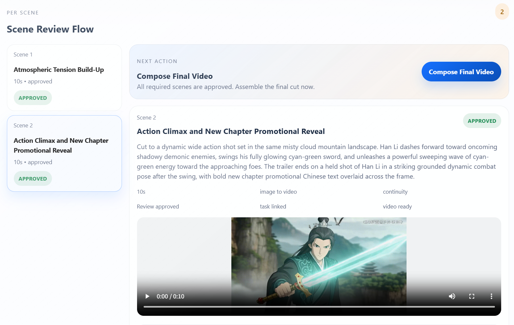
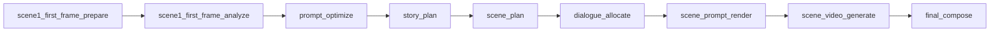

<table>
  <tr>
    <td>
      <h1>Video Workflow Service</h1>
    </td>
    <td align="right">
      
    </td>
  </tr>
</table>

This is a full-stack project for building video generation workflows. The current version provides a runnable short-video workflow centered on real model calls, opening-frame orchestration, per-scene planning, scene-level HITL, and final composition.

中文说明：
[README.zh-CN.md](README.zh-CN.md)

Technical introduction:
[project-technical-introduction.md](docs/architecture/project-technical-introduction.md)

## Python Environment

Python commands in this repository are managed with `uv`.

Create or refresh the local virtual environment:

```bash
uv sync
```

Then run Python entrypoints through `uv run ...` so the project always uses the managed interpreter and environment.

It implements these workflow steps:

1. prompt optimization
2. story planning
3. scene planning
4. storyboard upload
5. per-scene video generation
6. final composition
7. delivery

The service now supports two orchestration modes:

- `auto`
  The existing one-shot background workflow that runs prompt optimization through final composition automatically.
- `hitl`
  Scene-by-scene generation with human approval gates before the next scene can continue.

- default provider: `doubao`
- default scene count: `3`
- default model: `doubao-seedance-1-5-pro-251215`
- default audio mode: provider-native synchronized audio enabled

## Prerequisites

To run the real workflow end to end, make sure these dependencies are available:

- Python environment managed by `uv`
- Node.js and `npm` for the frontend workspace
- `ffmpeg` available on `PATH`
- A Doubao / Ark account with access to:
  - the video model you want to use
  - `doubao-seed-2-0-lite-260215` for LLM planning nodes
  - `doubao-seedream-5-0-lite-260128` for auto-generated opening stills

## Runtime Configuration

The service only reads runtime config from this repository:

1. `.env`
2. `.env.local`

Create the local env file from the example:

```bash
cp .env.example .env
```

For a real run, the minimum recommended `.env` is:

```bash
DOUBAO_API_KEY=your_doubao_api_key
DOUBAO_BASE_URL=https://ark.cn-beijing.volces.com

VIDEO_WORKFLOW_PROVIDER=doubao
VIDEO_WORKFLOW_LLM_PROVIDER=doubao

DOUBAO_DEFAULT_MODEL=doubao-seedance-1-5-pro-251215
VIDEO_WORKFLOW_LLM_DEFAULT_MODEL=doubao-seed-2-0-lite-260215
VIDEO_WORKFLOW_IMAGE_DEFAULT_MODEL=doubao-seedream-5-0-lite-260128

VIDEO_WORKFLOW_LOG_LEVEL=INFO
```

If you want to keep the default official paths, these values can stay unchanged:

```bash
DOUBAO_VIDEO_CREATE_PATH=/api/v3/contents/generations/tasks
DOUBAO_VIDEO_QUERY_PATH=/api/v3/contents/generations/tasks/{task_id}
DOUBAO_IMAGE_GENERATE_PATH=/api/v3/images/generations
DOUBAO_LLM_CHAT_PATH=/api/v3/chat/completions
```

Optional overrides:

```bash
DOUBAO_T2V_MODEL=doubao-seedance-1-5-pro-251215
DOUBAO_I2V_SINGLE_MODEL=doubao-seedance-1-5-pro-251215
DOUBAO_I2V_FLF_MODEL=doubao-seedance-1-5-pro-251215
VIDEO_WORKFLOW_LLM_PROMPT_OPTIMIZE_MODEL=
VIDEO_WORKFLOW_LLM_STORY_PLAN_MODEL=
VIDEO_WORKFLOW_LLM_SCENE_PLAN_MODEL=
VIDEO_WORKFLOW_LLM_DIALOGUE_ALLOCATE_MODEL=
VIDEO_WORKFLOW_LLM_FIRST_FRAME_ANALYZE_MODEL=
VIDEO_WORKFLOW_LLM_SCENE_PROMPT_RENDER_MODEL=
VIDEO_WORKFLOW_LLM_DIALOGUE_SPLIT_MODEL=
VIDEO_WORKFLOW_LLM_TIMEOUT_SECONDS=120
DOUBAO_LLM_API_KEY=
DOUBAO_LLM_BASE_URL=
VIDEO_WORKFLOW_SCENE_COUNT=3
VIDEO_WORKFLOW_MAX_WORKERS=2
VIDEO_WORKFLOW_PORT=8787
```

Notes:

- Shell environment variables take priority over `.env`.
- `.env.local` overrides `.env`.
- If `VIDEO_WORKFLOW_LLM_PROVIDER` is not explicitly set to `doubao`, the planning nodes may fall back to the internal `mock` LLM in local/offline scenarios.
- After changing `.env`, restart the backend service.

## Quick Start

### 1. Install Python dependencies

```bash
uv sync
```

### 2. Install frontend dependencies

```bash
cd frontend
npm install
cd ..
```

### 3. Start the backend

```bash
uv run python -m video_workflow_service.cli server --host 127.0.0.1 --port 8787
```

### 4. Start the frontend in development mode

```bash
cd frontend
npm run dev
```

Open `http://127.0.0.1:5173/`.

## UI Overview

The current browser UI is organized as:

- a left-side scene timeline
- a right-side active scene workspace
- a sticky next-action rail that guides the HITL flow

Example interface:



## Scene 1 Opening Still Setup

Before creating the project, choose one opening still source for `scene-01`:

- `upload`
  Upload the exact opening still that scene 1 should start from.
- `auto_generate`
  Let the workflow generate the opening still after planning.

Usage notes:

- `upload` requires the image file before project creation.
- `auto_generate` does not require a manual still prompt at project creation time.
- After the opening still is ready, the workflow analyzes it and uses those image facts as the opening truth for planning and prompt compilation.

## Workflow Planning Nodes

The main planning and generation chain is:



For `scene-01`, concrete first-frame context is prepared before `prompt_optimize` and `scene_plan`, so planning can anchor itself to the actual opening still instead of inventing a conflicting start state.

The first implementation uses the Doubao Ark Chat API and keeps model selection separate from provider selection:

- provider: `VIDEO_WORKFLOW_LLM_PROVIDER=doubao`
- default model: `VIDEO_WORKFLOW_LLM_DEFAULT_MODEL=doubao-seed-2-0-lite-260215`
- optional per-node overrides:
  - `VIDEO_WORKFLOW_LLM_PROMPT_OPTIMIZE_MODEL`
  - `VIDEO_WORKFLOW_LLM_STORY_PLAN_MODEL`
  - `VIDEO_WORKFLOW_LLM_SCENE_PLAN_MODEL`
  - `VIDEO_WORKFLOW_LLM_DIALOGUE_ALLOCATE_MODEL`
  - `VIDEO_WORKFLOW_LLM_FIRST_FRAME_ANALYZE_MODEL`
  - `VIDEO_WORKFLOW_LLM_SCENE_PROMPT_RENDER_MODEL`
  - `VIDEO_WORKFLOW_LLM_DIALOGUE_SPLIT_MODEL`

For offline tests, the service falls back to the internal `mock` LLM provider unless `VIDEO_WORKFLOW_LLM_PROVIDER` is explicitly configured.
Structured LLM outputs and HITL edits are appended to:

```text
runtime_data/logs/<project_id>/workflow_trace.jsonl
```

## Run The Local Workflow

```bash
uv run python -m video_workflow_service.cli run \
  --prompt "A coffee brand launches a short cinematic ad about late-night creativity." \
  --duration 15 \
  --scene-count 3
```

The command prints the project JSON and writes artifacts under `runtime_data/artifacts/`.

## Start The HTTP Server

```bash
uv run python -m video_workflow_service.cli server --host 127.0.0.1 --port 8787
```

## Frontend Development Mode

Start the backend first:

```bash
cd ..
uv run python -m video_workflow_service.cli server --host 127.0.0.1 --port 8787
```

Then start the Vite dev server:

```bash
cd frontend
npm run dev
```

Open `http://127.0.0.1:5173/`.

The dev server proxies `/health`, `/providers`, `/projects`, and `/artifacts` to the Python backend.
If the backend runs on another address, set `VITE_API_PROXY_TARGET` before `npm run dev`.

The default browser flow now creates projects in `hitl` mode so you can:

1. create a project
2. review the planned scenes
3. choose `auto_generate`, `continuity`, or `upload` for each scene first frame
4. upload a first-frame image when needed
5. generate one scene at a time
6. approve each scene
7. compose the final video after all scenes are approved

## Integrated Build Mode

Use this mode for integrated verification with the Python server hosting the built frontend assets:

```bash
cd frontend
npm run build

cd ..
uv run python -m video_workflow_service.cli server --host 127.0.0.1 --port 8787
```

Open `http://127.0.0.1:8787/`.

## HTTP Example Flow

Create a project:

```bash
curl -X POST http://127.0.0.1:8787/projects \
  -H 'Content-Type: application/json' \
  -d '{
    "title": "Launch Project",
    "prompt": "A startup founder records a bold product launch teaser in three scenes.",
    "target_duration_seconds": 15,
    "provider": "doubao",
    "scene_count": 3,
    "workflow_mode": "hitl"
  }'
```

Run the full workflow synchronously:

```bash
curl -X POST http://127.0.0.1:8787/projects/<project_id>/workflow/run
```

Queue the workflow for background execution:

```bash
curl -X POST http://127.0.0.1:8787/projects/<project_id>/workflow/start
```

Inspect background workflow status:

```bash
curl http://127.0.0.1:8787/projects/<project_id>/workflow/status
```

Upload storyboard references after planning scenes:

```bash
curl -X POST http://127.0.0.1:8787/projects/<project_id>/storyboards/upload \
  -H 'Content-Type: application/json' \
  -d '{
    "scenes": [
      {
        "scene_index": 1,
        "first_frame_source": "upload",
        "first_frame_image": "/absolute/path/to/first-frame.png",
        "reference_image": "/absolute/path/to/reference.png",
        "storyboard_notes": "Low-angle opening shot"
      }
    ]
  }'
```

Queue a single scene for generation in `hitl` mode:

```bash
curl -X POST http://127.0.0.1:8787/projects/<project_id>/scenes/scene-01/generate
```

Approve a generated scene and unlock the next scene:

```bash
curl -X POST http://127.0.0.1:8787/projects/<project_id>/scenes/scene-01/approve
```

Compose the final cut after every scene is approved:

```bash
curl -X POST http://127.0.0.1:8787/projects/<project_id>/compose
```

Inspect the project:

```bash
curl http://127.0.0.1:8787/projects/<project_id>
```

Generated video files are served under `/artifacts/...`.

List available providers and capabilities:

```bash
curl http://127.0.0.1:8787/providers
```

## Tests

```bash
uv run python -m unittest discover -s tests -v
```

Tests force `provider=mock` to stay offline and deterministic.
