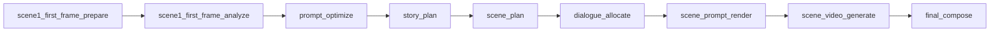

<table>
  <tr>
    <td>
      <h1>Video Workflow Service</h1>
    </td>
    <td align="right">
      
    </td>
  </tr>
</table>

这是一个用于构建视频生成工作流的前后端一体项目。当前版本围绕真实模型调用、首帧编排、分场景规划、场景级 HITL 和最终视频合成，提供了一条可直接运行的短视频工作流链路。

English README:
[README.md](README.md)

技术介绍：
[project-technical-introduction.md](docs/architecture/project-technical-introduction.md)

## 项目概览

当前项目面向“从一个总体创意出发，拆分为多个可控场景并逐步生成成片”的使用场景。系统已经具备完整的前后端形态：后端负责工作流编排、模型调用和状态持久化，前端负责场景查看、首帧设置、提示词调整、逐场景审核和最终合成操作。

在能力边界上，当前版本优先解决的是工作流稳定性和可控性：

- 从全局创意到分场景规划的结构化拆解
- 首帧上传、自动生成、连续性输入三类起点控制
- 分场景 prompt 编译与逐场景视频生成
- 场景级 HITL 审核和最终成片合成

在此基础上，后续可以继续引入更多 agent 化能力，但当前主路径仍然是清晰、可追踪的 workflow 系统。

当前主要能力：

1. 提示词优化
2. 全局故事规划
3. 分场景规划
4. 分场景对白分配
5. 首帧准备与图片理解
6. 场景级视频提示词编译
7. 分场景视频生成
8. 最终视频合成

支持两种模式：

- `auto`
  自动跑完整条链路
- `hitl`
  场景逐个生成，用户逐个审核批准

## 前置依赖

要跑通真实链路，至少需要这些环境：

- 使用 `uv` 管理 Python 环境
- 已安装 `Node.js` 和 `npm`
- 系统里可直接调用 `ffmpeg`
- 你自己的 Doubao / Ark 账号，并开通这些模型能力：
  - 视频生成模型
  - `doubao-seed-2-0-lite-260215`，用于规划类 LLM 节点
  - `doubao-seedream-5-0-lite-260128`，用于首帧自动生图

## 环境配置

项目只会读取当前仓库里的：

1. `.env`
2. `.env.local`

先复制一份示例配置：

```bash
cp .env.example .env
```

最小推荐配置如下：

```bash
DOUBAO_API_KEY=your_doubao_api_key
DOUBAO_BASE_URL=https://ark.cn-beijing.volces.com

VIDEO_WORKFLOW_PROVIDER=doubao
VIDEO_WORKFLOW_LLM_PROVIDER=doubao

DOUBAO_DEFAULT_MODEL=doubao-seedance-1-5-pro-251215
VIDEO_WORKFLOW_LLM_DEFAULT_MODEL=doubao-seed-2-0-lite-260215
VIDEO_WORKFLOW_IMAGE_DEFAULT_MODEL=doubao-seedream-5-0-lite-260128

VIDEO_WORKFLOW_LOG_LEVEL=INFO
```

如果你沿用默认接口路径，这些通常不用改：

```bash
DOUBAO_VIDEO_CREATE_PATH=/api/v3/contents/generations/tasks
DOUBAO_VIDEO_QUERY_PATH=/api/v3/contents/generations/tasks/{task_id}
DOUBAO_IMAGE_GENERATE_PATH=/api/v3/images/generations
DOUBAO_LLM_CHAT_PATH=/api/v3/chat/completions
```

常见可选项：

```bash
DOUBAO_T2V_MODEL=doubao-seedance-1-5-pro-251215
DOUBAO_I2V_SINGLE_MODEL=doubao-seedance-1-5-pro-251215
DOUBAO_I2V_FLF_MODEL=doubao-seedance-1-5-pro-251215
VIDEO_WORKFLOW_LLM_PROMPT_OPTIMIZE_MODEL=
VIDEO_WORKFLOW_LLM_STORY_PLAN_MODEL=
VIDEO_WORKFLOW_LLM_SCENE_PLAN_MODEL=
VIDEO_WORKFLOW_LLM_DIALOGUE_ALLOCATE_MODEL=
VIDEO_WORKFLOW_LLM_FIRST_FRAME_ANALYZE_MODEL=
VIDEO_WORKFLOW_LLM_SCENE_PROMPT_RENDER_MODEL=
VIDEO_WORKFLOW_LLM_DIALOGUE_SPLIT_MODEL=
VIDEO_WORKFLOW_LLM_TIMEOUT_SECONDS=120
DOUBAO_LLM_API_KEY=
DOUBAO_LLM_BASE_URL=
VIDEO_WORKFLOW_SCENE_COUNT=3
VIDEO_WORKFLOW_MAX_WORKERS=2
VIDEO_WORKFLOW_PORT=8787
```

说明：

- Shell 环境变量优先级高于 `.env`
- `.env.local` 会覆盖 `.env`
- 改完 `.env` 后，需要重启后端
- 如果没有显式设置 `VIDEO_WORKFLOW_LLM_PROVIDER=doubao`，本地某些场景下可能会回退到内部 `mock` LLM

## 快速启动

### 1. 安装 Python 依赖

```bash
uv sync
```

### 2. 安装前端依赖

```bash
cd frontend
npm install
cd ..
```

### 3. 启动后端

```bash
uv run python -m video_workflow_service.cli server --host 127.0.0.1 --port 8787
```

### 4. 启动前端开发环境

```bash
cd frontend
npm run dev
```

浏览器打开：

```text
http://127.0.0.1:5173/
```

## 界面概览

当前前端交互采用：

- 左侧 `scene timeline`
- 右侧 `active scene workspace`
- 顶部 `next action`

示意图：


## 首场景首帧规则

创建项目之前，需要先为 `scene-01` 选择一个 opening still 来源：

- `upload`
  直接上传首场景的起始画面
- `auto_generate`
  由系统在规划后自动生成首场景首帧图

使用说明：

- 选择 `upload` 时，创建项目之前必须先提供图片
- 选择 `auto_generate` 时，创建项目时不需要手工填写 still prompt
- 首帧图准备完成后，系统会先做图片理解，再把首帧事实作为后续规划和提示词编译的起点约束

## 工作流节点

主链路如下：



这几层的作用是：

- `prompt_optimize`
  收敛全局创意、风格和对白素材
- `story_plan`
  先做全局叙事规划，决定每个 scene 的叙事职责
- `scene_plan`
  把每个 scene 落到视觉、动作、镜头层
- `dialogue_allocate`
  根据总时长、scene 数和场景职责分配对白
- `scene_prompt_render`
  把上游规划编译成视频模型能消费的场景提示词
- `scene_video_generate`
  调真实视频模型生成场景视频
- `final_compose`
  合成最终成片

## 前端工作流

默认浏览器流程会创建 `hitl` 模式项目，你可以按下面这条路径操作：

1. 创建项目
2. 查看规划结果
3. 为每个场景设置首帧来源
4. 编辑当前场景 `Scene Prompt`
5. 点击 `Generate Scene`
6. 审核并 `Approve Scene`
7. 系统自动聚焦下一个可操作场景
8. 全部场景批准后，执行 `Compose Final Video`

## 本地命令示例

直接跑一条本地工作流：

```bash
uv run python -m video_workflow_service.cli run \
  --prompt "A coffee brand launches a short cinematic ad about late-night creativity." \
  --duration 15 \
  --scene-count 3
```

产物会写到：

```text
runtime_data/artifacts/
```

## 集成模式

如果你想让 Python 服务直接托管前端构建产物：

```bash
cd frontend
npm run build

cd ..
uv run python -m video_workflow_service.cli server --host 127.0.0.1 --port 8787
```

打开：

```text
http://127.0.0.1:8787/
```

## 关键产物目录

- `runtime_data/projects/`
  项目状态快照
- `runtime_data/artifacts/`
  场景视频、尾帧、最终视频
- `runtime_data/logs/<project_id>/workflow_trace.jsonl`
  工作流轨迹和 LLM / HITL 记录

## 当前说明

当前版本已经能支持：

- 真实 Doubao/Seedance 视频生成
- 基于 LLM 的场景规划和对白分配
- 首帧上传、自动生成、连续性输入
- 场景级 HITL 审核
- 最终视频合成与交付

如果你想了解更完整的架构设计，建议直接看：

- [project-technical-introduction.md](docs/architecture/project-technical-introduction.md)
- [video-workflow-service.md](docs/architecture/video-workflow-service.md)
